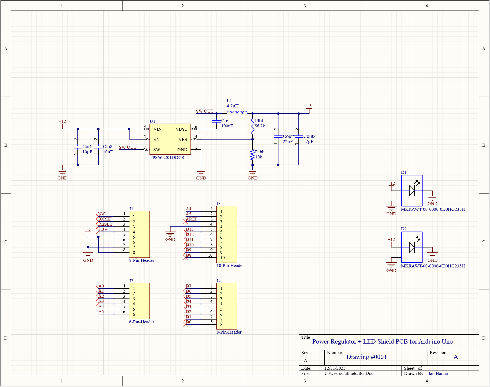

# Power Regulation + LED Arduino Shield (Altium)

## Overview
A 2-layer Arduino Uno shield that accepts a 12V DC input, regulates it to 5V with
high efficiency, powers an Arduino Uno via the 5V header pin, and distributes 12V
to two high-power SMD LEDs in parallel.

This project demonstrates an end-to-end PCB workflow: requirements → schematic →
PCB layout → DRC/DFM cleanup → manufacturing outputs.

## Requirements (Design Targets)
- Input: 12V DC
- Regulated output: 5V DC
- Efficiency: ≥ 90%
- Load: Arduino Uno + 2× high-power SMD LEDs (≥10W each) in parallel
- Form factor: Arduino Uno shield using standard pin headers
- Components placed on top layer only
- Standard board thickness (~62 mil), 2-layer stackup

## Architecture
- +12V path: input connector → LED bank (parallel) + regulator input
- +5V path: regulator output → Arduino Uno 5V header pin
- Ground strategy: bottom-layer ground pour for low impedance returns

## Implementation Notes
- Switching regulator selected to meet efficiency target
- Pin header footprints / symbols may be custom-built (Arduino shield pattern)
- Power rails implemented with polygon pours for current capacity

## Repo Layout
- `hardware/altium/` – Altium project (schematic + PCB)
- `docs/` – schematic PDF + fabrication/assembly drawing (Draftsman)
- `outputs/` – Gerbers/NC drill/ODB++/BOM/PnP
- `media/` – screenshots (schematic, layout, 3D render)

## How to Review
1. Start with `docs/` for schematic + drawings
2. Inspect `media/` for layout decisions (polygons, ground pour, placement)
3. Use `outputs/` to verify fabrication readiness (Gerbers + drills + BOM + PnP)

## Design Screenshots

### Schematic

### PCB Layout

### 3D View

