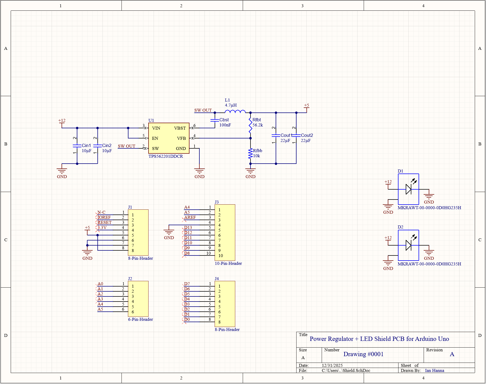
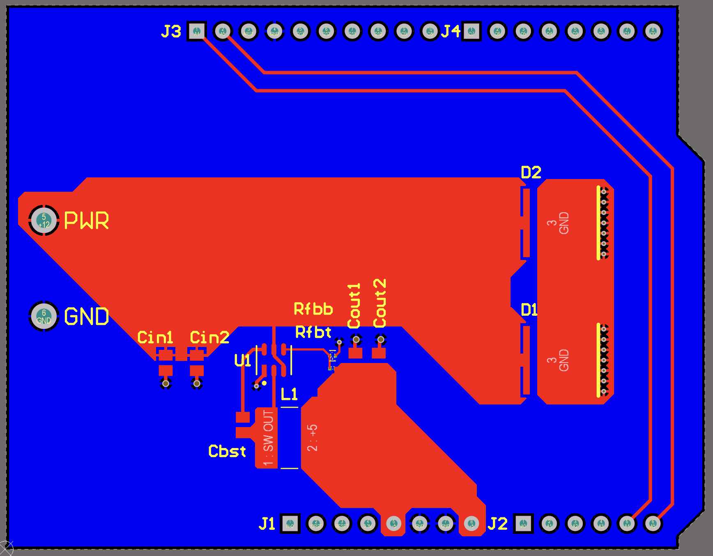
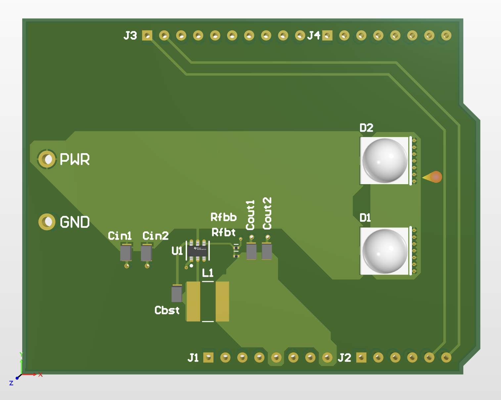

# Power Regulation + LED Arduino Shield (Altium)

## Overview
A 2-layer Arduino Uno shield design that accepts a 12V DC input, uses a
TPS562201 buck regulator to generate a nominal 5V rail, and distributes 12V to
two 12V-rated SMD LED modules in parallel.

This project demonstrates an end-to-end PCB workflow: requirements → schematic →
PCB layout → DRC/DFM cleanup → fabrication-document generation.

## Requirements (Design Targets)
- Input: 12V DC
- Regulated output: 5V DC
- Efficiency target: ≥ 90% (not yet validated by measurement)
- Load: Arduino Uno + 2× high-power SMD LEDs (≥10W each) in parallel
- Form factor: Arduino Uno shield using standard pin headers
- Components placed on top layer only
- Standard board thickness (~62 mil), 2-layer stackup

## Architecture
- +12V path: input connector → LED bank (parallel) + regulator input
- +5V path: regulator output → Arduino Uno 5V header pin
- Ground strategy: bottom-layer ground pour for low impedance returns

## Implementation Notes
- Switching regulator selected to meet efficiency target
- Pin header footprints / symbols may be custom-built (Arduino shield pattern)
- Power rails implemented with polygon pours for current capacity

## Repo Layout
- `hardware/altium/` – Altium project (schematic + PCB)
- `docs/` – schematic PDF + draft fabrication/assembly drawing
- `outputs/` – Gerber layers, BOM, pick-and-place data, and drill report
- `media/` – screenshots (schematic, layout, 3D render)

## How to Review
1. Start with `docs/` for schematic + drawings
2. Inspect `media/` for layout decisions (polygons, ground pour, placement)
3. Use `outputs/` to review the exported Gerber layers, BOM, and placement data

## Validation status

- Schematic, PCB layout, and fabrication drawings are provided for design review
- The fabrication/assembly drawing is explicitly marked as a draft and still
  contains template notes that must be finalized
- The efficiency target has not been verified by bench measurement
- The repository does not currently include an Excellon drill file or ODB++ package
- The output set should be regenerated and reviewed before ordering boards
- When powering an Arduino through its 5V header, avoid connecting another active
  5V source unless the board's power-path behavior has been verified

## Design Screenshots

### Schematic

### PCB Layout

### 3D View

